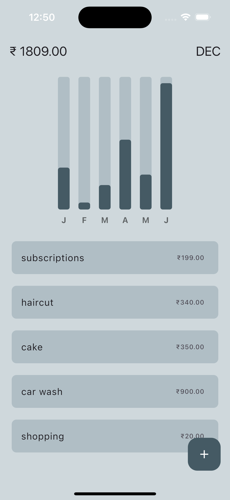

 
# Expense Tracker APP using Flutter

I've created a Expense Tracker App using Flutter and Dart
Which uses ISAR Database to store data locally and also shows monthly expense summery in Bar Graph.

## Project Structure
```
expense_tracker
├── lib
│   ├── bar_graph
│   │   ├── bar_graph.dart
│   │   └── individual_bar.dart
│   ├── components
│   │   └── my_list_tile.dart
│   ├── db
│   │   └── expense_db.dart
│   ├── helper
│   │   └── helper_functions.dart
│   ├── models
│   │   ├── expense.dart
│   │   └── expense.g.dart
│   ├── pages
│   │   ├── home_page.dart
│   │   └── main.dart
```

## Visual Diagram

<tr>
  
</tr>

## Setup

Run the following commands from your terminal:

1) `git clone https://github.com/quibler7/expense_tracker` to clone this repository 

2) `flutter pub get` in the project root directory to install all the required dependencies.

## Screenshot

<tr>
  
</tr>

